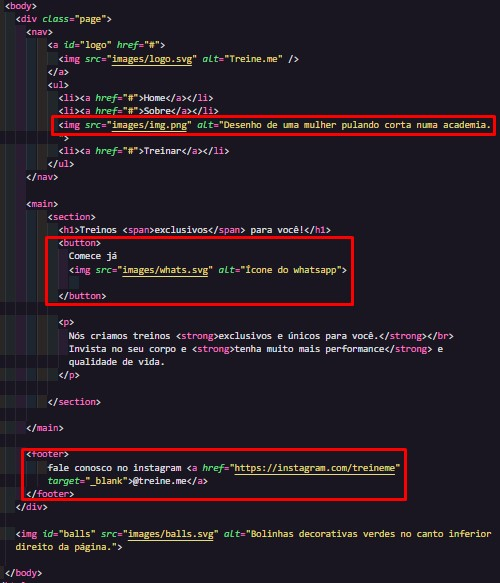
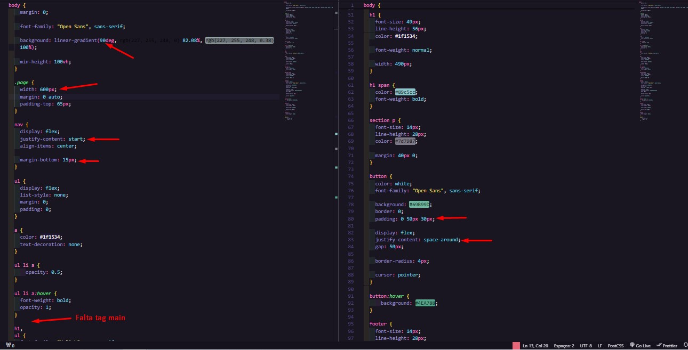

<h1 align="center">Código do desafio - Fase 02 - Corrigindo bugs</h1>

.

|
  <a href="#-tecnologias">Tecnologias</a> |
  <a href="#-projeto">Projeto</a> | 
  <a href="#-layout">Layout</a> | 
  <a href="#memo-licença">Licença</a> | 

  

## 📖 Tecnologias

Esse projeto foi desenvolvido com  as seguintes tecnologias:

- HTML e CSS3
- GIT e GITHUB
- FIGMA

## 💻 Desafio

O desafio proposto foi, corrigir bugs no HTML e no CSS3, e ficou constatado que a estrutura do HTML estava totalmente fora da ordem logica e no CSS3 algumas  configurações erradas e faltando o main, segue abaixo relação do HTML e CSS3 que foram corrigidos:

Obs: Através desse exercício consegui também encontrar alguns erros de digitação no primeiro arquivo CSS3 feito no projeto original.

HTML: 

  

  
  

CSS3:

  

  
  

## 📐 Layout

Você pode visualizar o layout do projeto através [DESSE LINK](https://www.figma.com/file/rkDOHGPwwFtBNqEdHSuQPd/Projeto-02---Explorer?type=design&node-id=0-1&mode=design&t=7gRgluydhvlDk6rl-0). É necessário ter conta no [Figma](https://figma.com) para acessá-lo.
## :memo: Licença

Esse projeto está sob a licença MIT.

---

Feito com ❤ by Rocketseat :wave: [Participe da nossa comunidade!](https://discord.gg/rocketseat)